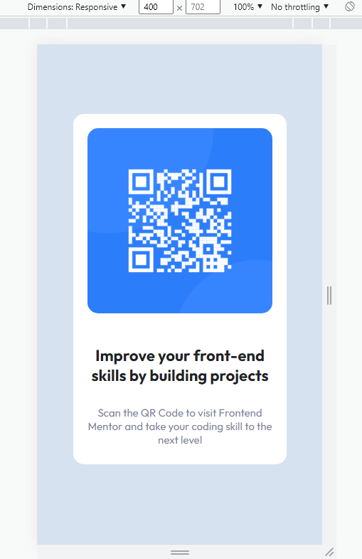

# QRCode Frontend Mentor Challenge

This is a challenge that was made by the [Frontend Mentor](https://www.frontendmentor.io/home) website, in order to improve frontend skills, in this case, the images, model and an HTML template were passed to start with.

Prefer to start using only HTML and CSS because they are two areas that I want to improve and I know very little, despite scratching in React and Angular.

# Desktop Presentation

As a requirement was passed that the desktop be made up to 1440px width, using the Outfit font, and having a template already ready, I tried to use simple concepts and write as little as possible to do this challenge.

From max-width to flexbox, the thought was to make the code as small as possible, but it would still do the job, I don't know if I used the best practices in this area, but I tried to make it as understandable as possible of what each thing was doing.

# Mobile Presentation

As for the mobile version, I really didn't do anything, because the structure of the website was well done and it was already redirecting correctly and centrally on the screen, thinking that the screen has at least 400px it can be easily used.

# Future considerations

The idea is to revisit this repository in the future and update it to new features such as SASS or LESS, React among other proposals, adding animations and even a little logic, but it has to be thought through beforehand.